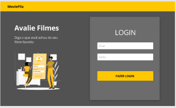
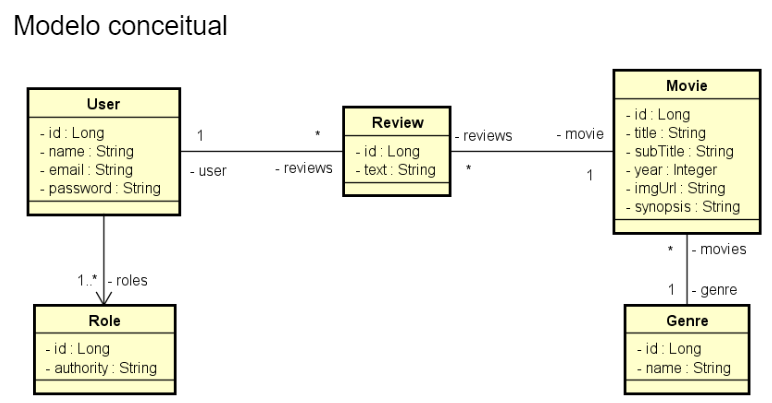

<div align="center" id="top">

# Movieflix

---


---

[Sobre](#dart-sobre) | [Características](#sparkles-caracteristicas) | [Tecnologias](#rocket-tecnologias) | [Requerimentos](#white_check_mark-requerimentos) | [Iniciando](#checkered_flag-iniciando) | [Referências](#books-referências)

</div>

## :dart: Sobre



O sistema movieflix usa spring boot como backend, e o ReactJS como frontweb, onde é desenvolvido como desafio do Bootcamp [DevSuperior](https://devsuperior.com.br/).

O sistema MovieFlix consiste em um banco de filmes, os quais podem ser listados e avaliados pelos usuários. Usuários podem ser visitantes (VISITOR) e membros (MEMBER). Apenas usuários membros podem inserir avaliações no sistema.

Ao acessar o sistema, o usuário deve fazer seu login. Apenas usuários logados podem navegar nos filmes. Logo após fazer o login, o usuário vai para a listagem de filmes, que mostra os filmes de forma paginada, ordenados alfabeticamente por título. O usuário pode filtrar os filmes por gênero.

Ao selecionar um filme da listagem, é mostrada uma página de detalhes, onde é possível ver todas informações do filme, e também suas avaliações. Se o usuário for MEMBER, ele pode ainda registrar uma avaliação nessa tela.

Um usuário possui nome, email e senha, sendo que o email é seu nome de usuário. Cada filme possui um título, subtítulo, uma imagem, ano de lançamento, sinopse, e um gênero. Os usuários membros podem registrar avaliações para os filmes. Um mesmo usuário membro pode deixar mais de uma avaliação para o mesmo filme.



## :sparkles: Caracteristicas

### Backend

- Segurança com validação de dados, autenticação e autorização de acesso:
  - Caso de uso: Efetuar login
  - [IN] O usuário anônimo informa seu email e senha
  - [OUT] O sistema informa um token válido

- API de listar filmes:
  - Caso de uso: Listar filmes
  - [OUT] O sistema apresenta uma listagem dos nomes de todos gêneros, bem como uma listagem paginada com título, subtítulo, ano e imagem dos filmes, ordenada alfabeticamente por título.
  - [IN] O usuário visitante ou membro seleciona, opcionalmente, um gênero.
  - [OUT] O sistema apresenta a listagem atualizada, restringindo somente ao gênero selecionado.

- API de detalhes de filmes;
  - Caso de uso: Visualizar detalhes do filme
  - [IN] O usuário visitante ou membro seleciona um filme
  - [OUT] O sistema informa título, subtítulo, ano, imagem e sinopse do filme, e também uma listagem dos textos das avaliações daquele filme juntamente com nome do usuário que fez cada avaliação.
  - [IN] O usuário membro informa, opcionalmente, um texto para avaliação do filme.
  - [OUT] O sistema apresenta os dados atualizados, já aparecendo também a avaliação feita pelo usuário.

- Validação de dados
  - Exceção - Texto vazio. O sistema apresenta uma mensagem de que não é permitido texto vazio na avaliação

- Testes automatizados;

### Frontend

- Ao acessar a rota raiz do app, deverá aparecer uma tela de login.
- Ao fazer login com sucesso, o usuário deverá ser redirecionado para a rota /movies que corresponde à tela de listagem de filmes.
- Durante todo o tempo em que o usuário estiver logado, deverá aparecer na barra de navegação um botão "Sair" que deverá realizar o logout do usuário e redirecioná-lo para a tela de login.
- A tela de listagem de filmes deve exibir apenas um título, e dois links para os detalhes dos filmes de código 1 e 2 respectivamente.

## :rocket: Tecnologias

As seguintes tecnologias são utilizadas no backend do projeto:

- [Java JDK 11](https://docs.oracle.com/en/java/javase/11/);
  - [Maven builder](https://maven.apache.org/);
  - [Spring Boot framework](https://glysns.gitbook.io/springframework/);
    - [Spring Data JPA][JPA]
  - [PgAdmin database administration platform](https://www.pgadmin.org/);
  - Login [OAuth2][OAuth2]
- Interceptors
- [Armazenamento de dados][JPA]
  - [Acesso a dados][AccessingData]
  - JSON parse / stringify
- Estado global com Context API
- Fluxos de autenticação e autorização
  - Rotas protegidas
  - Redirecionamentos de login e de autorização
  - Redirecionamentos especiais para experiência do usuário (UX)
  - Permissionamento em nível de rotas
  - Restrição de conteúdo (UI) baseada em perfil de usuário

No Frontend web são usadas as seguintes tecnologias:

- [ReactJS][ReactJS]
  - Criação de projeto
  - Estrutura do projeto
  - Componentes
  - Importações
  - Uso de imagens
- Layout
  - HTML
  - CSS
    - Estilização manual
    - [Flexbox][Flexbox]
    - Bootstrap
    - [Responsividade][CSSFlexbox]
  - Execução de [projeto Figma][Figma]
- Rotas
  - [React Router DOM][ReactRouting]
  - Rotas e links
- Formulários
  - Tratamento de eventos
  - [Manipulação do estado do formulário][ReactForms]
  - Submissão de formulário

## :white_check_mark: Requerimentos

- Para o Backend - Antes de iniciar :checkered_flag:, é necessário ter o ambiente [Java JDK 11][JDK], [Git][Git] e [Maven][Maven] instalados.
- Para o Frontend - :checkered_flag:, é necessário ter instalados o ambiente [NodeJS](https://nodejs.org/en) para executar o ReactJS, e  o [Yarn](https://classic.yarnpkg.com/en/docs/install) para gerenciar as dependências.

## :checkered_flag: Iniciando

> Clone o projeto

```bash
git clone https://github.com/jocile/movieflix.git
```

> Acesse a pasta do projeto no terminal e entre na pasta do backend:

```bash
cd .\backend
```

> Execute o seguinte comando para executar o backend do projeto:

```bash
mvnw spring-boot:run
```

### :tada: Visualizando o App

> A backend API será inicializada no browser: <http://localhost:8080>\
> O banco de dados in-memory H2 pode ser visualizado em: <http://localhost:8080/h2-console>\
> 🚧 O frontend web 🚀 foi inicializado com [create-react-app.dev](https://create-react-app.dev) 🚧

Para o Frontend web:
> Acesse a pasta frontweb no terminal

```bash
cd ..\frontweb
```

> Execute o seguinte comando para executar o frontend que abrirá uma página no navegador:

```bash
yarn start
```

> Isto irá Executar o aplicativo no modo de desenvolvimento.\
> O browser exibirá a app na página: <http://localhost:3000> para visualizá-lo no navegador.\
> Para fazer Login como visitante use: `bob@gmail.com`\
> Para fazer Login como membro use: `ana@gmail.com`\
> Use a senha: `123456`\
> A página será recarregada se você fizer edições.\
> Você também verá quaisquer erros de lint no console.

## :books: Referências

- :file_folder: [Bootcamp Documentação SDS 5][Bootcamp];
- :file_folder: [Collection do Postman para testar a API][Postman];
- :art: [Protótipos de tela para o Frontend no Figma][Figma];
  
<details><summary><b>Mostrar referências para o Backend</b></summary>

- :books: [Official Apache Maven documentation][Maven];
- :link: [Spring Boot Maven Plugin Reference Guide][Maven];
- :link: [Create an OCI image][OCI];
- :link: [Spring Web][SpringWeb];
  - :link: [Building a RESTful Web Service][SpringREST];
  - :link: [Serving Web Content with Spring MVC][SpringMVC];
- :link: [Spring Data JPA][JPA];
  - :link: [Accessing Data with JPA][AccessingData];
- :link: [Spring Security][Security];
  - :link: [Securing a Web Application][SecuringWeb];
  - :link: [Enabling Cross Origin Requests for a RESTful Web Service][CORS];
  - :link: [Spring Boot and OAuth2][OAuth2];
  - :link: [Authenticating a User with LDAP][LDAP];

</details>

<details><summary><b>mostrar referências para o Frontend</b></summary>

- :books: Para aprender React, confira a [documentação do React][ReactDocs]
- :page_facing_up: [Formulários no ReactJS][ReactForms]
- :link: [Roteamento no ReactJS][ReactRouting]
- :link: [Recursos para o Frontend][FrontendResources]
- :wrench: [TreinaWeb - Instalando e gerenciando várias versões do NodeJS][NodeJS]
- :art: [W3Schools Flexbox][W3Schools]
- :art: [Flexbox][Flexbox]
- :art: [CSS Flexbox][CSSFlexbox]

</details>

[AccessingData]: https://spring.io/guides/gs/accessing-data-jpa/
[Bootcamp]: https://github.com/devsuperior/sds5
[CORS]: https://spring.io/blog/2022/02/21/spring-security-without-the-websecurityconfigureradapter
[CSSFlexbox]: https://css-tricks.com/snippets/css/a-guide-to-flexbox
[Flexbox]: https://flexboxfroggy.com/
[Figma]: https://www.figma.com/file/Yul1TnqQXmBsLwm5h5nvJu/MovieFlix-front-inicial
[FrontendResources]: https://github.com/devsuperior/dscatalog-resources/blob/9b5846b1157b296c3012f16c817f70ad1929fa6f/frontend-web/README.md
[Git]: https://git-scm.com
[JDK]: https://www.oracle.com/java/Tecnologias/downloads/#java11
[JPA]: https://docs.spring.io/spring-boot/docs/2.5.6/reference/htmlsingle/#Caracteristicas.sql.jpa-and-spring-data
[LDAP]: https://spring.io/guides/gs/authenticating-ldap/
[Maven]: https://maven.apache.org/guides/index.html
[NodeJS]: https://www.treinaweb.com.br/blog/instalando-e-gerenciando-varias-versoes-do-node-js-com-nvm/
[OAuth2]: https://spring.io/guides/tutorials/spring-boot-oauth2/
[OCI]: https://docs.spring.io/spring-boot/docs/2.4.12/maven-plugin/reference/html/#build-image
[Postman]: https://www.getpostman.com/collections/72a46c64473b7611a021
[ReactDocs]: https://pt-br.react.dev/
[ReactForms]: https://pt-br.reactjs.org/docs/forms.html
[ReactJS]: https://pt-br.react.dev/
[ReactRouting]: https://reactrouter.com/en/main/components/routes
[Security]: https://docs.spring.io/spring-boot/docs/2.7.0/reference/htmlsingle/#web.security
[SecuringWeb]: https://spring.io/guides/gs/securing-web/
[SpringWeb]: https://docs.spring.io/spring-boot/docs/2.5.6/reference/htmlsingle/#Caracteristicas.developing-web-applications
[SpringREST]: https://spring.io/guides/gs/rest-service/
[SpringMVC]: https://spring.io/guides/gs/serving-web-content/
[W3Schools]: https://www.w3schools.com/css/css3_flexbox.asp

[Voltar para o topo da página](#top)
